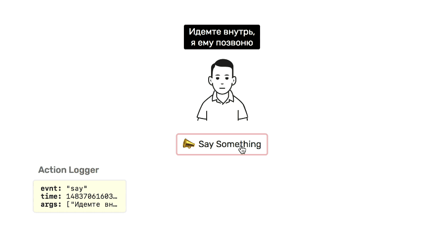
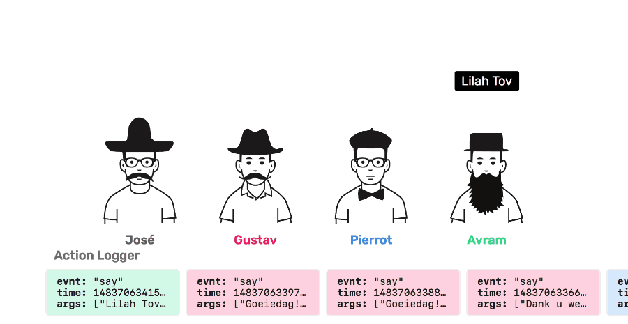

# Redux Actuator
Trigger events inside components by reacting on pure state changes. Actuator keeps you from writing
component lifecycle hooks boilerplate code by providing declarative API.

## Motivation
In Redux apps subscribing to events inside components is typically considered as an anti-pattern.
Components should be as pure as possible, meaning that they shouldn't have an internal state and
they can only respond to props changes. This makes even more sense if we take into an account
that React is ["pull"-based](https://facebook.github.io/react/contributing/design-principles.html): you
don't have a control over rendering, you simply take the data and provide corresponding piece of DOM.

But there are cases when you want to comminicate with components in an imperative way. Imagine if
you have an `<IframePreview>` component and you need to manually reload it when the button
is clicked. One possible way to achieve that is to introduce an integer prop `version`
and increment it on click.


The `<IframePreview>` external interface remains pure while its internal implementation uses
[`componentDidUpdate`](https://facebook.github.io/react/docs/react-component.html#componentdidmount)
callback in order to detect `version` changes and reload the iframe:

```JavaScript
class IframePreview extends Component {
  componentDidUpdate (prevProps) {
    if (prevProps.version !== this.props.version) {
      this.reloadIframe()
    }
  }
  // ...
}
```
When the app gets bigger the good idea is to move this counter to global state so you can control the
iframe from where the bussiness logic resides. In Redux you have to declare action constant, write a reducer
and action creator which isn't a problem for one component but becomes repetitive once you have more events
and listening components. **Redux Actuator** aims to hide this logic and provide declarative API for event
handling inside components.

## Installation
Redux Actuator is distributed as an NPM package:

```
npm install --save redux-actuator
```

Here how Redux Actuator is injected into Redux store:
```JavaScript
  import createEngine from 'redux-actuator'
  
  const engine = createEngine()
  
  const reducer = combineReducers({
    // It's important for the reducer to be mounted at `actuator`
    // If you'd like to set up different mounting point see Configuration section.
    actuator: engine.reducer,
    
    // ... your other reducers
  })
```
That's it! Now we are ready to actuate!

## Simpliest Actuator
One common use case for an actuator are state-free animations. Say, you want to animate this talking head:



```JavaScript
  import { Actuator } from 'redux-actuator'
  
  class ThisGuy extends React.Component {
  
    saySomething (phrase) {
      // your animation goes here
    }
  
    render () {
     
      // Actuator can wrap other components for brevity
      return (
        <Actuator events={{ say: (phrase) => this.saySomething(phrase)}}>
          <div>
            ...
          </div>
        </Actuator>
      )
    }
  }
```

How we are ready to trigger actions from the bussiness-logic part of the app:

```JavaScript
  import { actuate } from 'redux-actuator'
  
  // First argument is a channel
  store.dispatch(actuate('default', 'say', 'Hello!')
  store.dispatch(actuate('default', 'say', 'Hello!')
```

## Using Channels
TBD



## License
Copyright 2017, Alexey Taktarov <molefrog@gmail.com>

Permission is hereby granted, free of charge, to any person obtaining a copy of this software and associated documentation files (the "Software"), to deal in the Software without restriction, including without limitation the rights to use, copy, modify, merge, publish, distribute, sublicense, and/or sell copies of the Software, and to permit persons to whom the Software is furnished to do so, subject to the following conditions:

The above copyright notice and this permission notice shall be included in all copies or substantial portions of the Software.

THE SOFTWARE IS PROVIDED "AS IS", WITHOUT WARRANTY OF ANY KIND, EXPRESS OR IMPLIED, INCLUDING BUT NOT LIMITED TO THE WARRANTIES OF MERCHANTABILITY, FITNESS FOR A PARTICULAR PURPOSE AND NONINFRINGEMENT. IN NO EVENT SHALL THE AUTHORS OR COPYRIGHT HOLDERS BE LIABLE FOR ANY CLAIM, DAMAGES OR OTHER LIABILITY, WHETHER IN AN ACTION OF CONTRACT, TORT OR OTHERWISE, ARISING FROM, OUT OF OR IN CONNECTION WITH THE SOFTWARE OR THE USE OR OTHER DEALINGS IN THE SOFTWARE.
